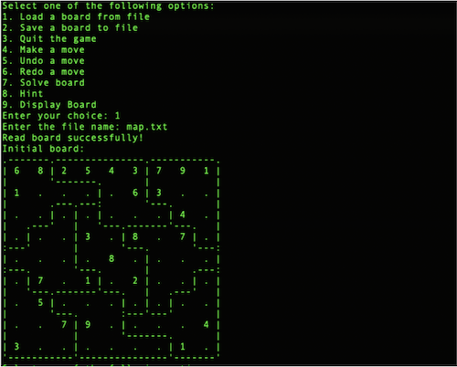

# Haskell Sudooku

This is a simple game of Sudoku that is build using the functional programming language called Haskell. It uses simple IO() and functions to run the game in the terminal.
## Installation

Must have the *ghc* command in order to build the executable.

```bash
./buildsudoku
```

This will compile the source code and generate an executable that can be used to run the program.

## Usage

```bash
./Sudoku
```

## Features
1. Loading a Sudoku board from a *.txt* file (the file must be in the same format as the examples given above).
2. Making moves
3. Saving the board in *.txt* file (same format as provided above), throws an error if the format is incorrect.
4. Undoing and Redoing a move
5. Quiting the game
6. Solver using backtracking
7. Hint for the next move (if possible)
8. Displaying the board in the terminal


# Example

Start Screen



Making a move

